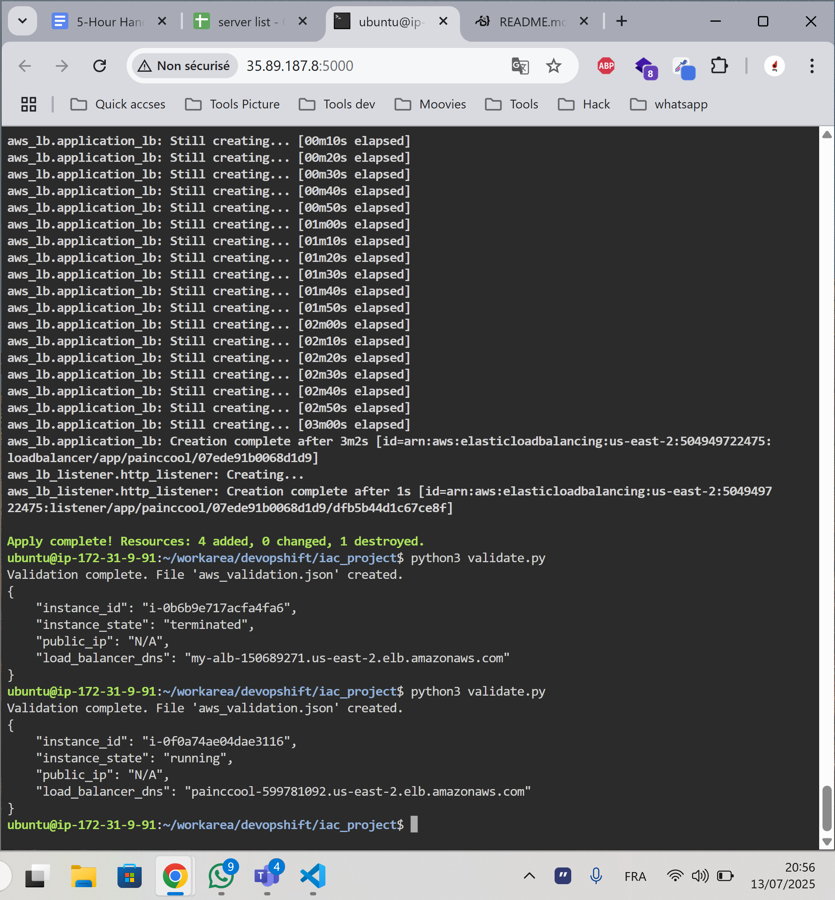

# aws ec2 deploy project

this project was for school exercice, we need to create one ec2 instence and load balancer with terraform and python

## what the project do

- ask question to user like ami and type of instance and name of loadbalancer
- generate terraform file with jinja
- run terraform init and apply from python code
- check on aws if instence is created and alb too
- save infos to json file

## tools used

- terraform
- python
- jinja2 (for template .tf file)
- boto3 (to validate on aws)
- subprocess for run command
- aws cli must be config with credentials

## how to run it

first need install deps :

pip install -r requirements.txt

then export aws keys (must already have one)

export AWS_ACCESS_KEY_ID=xxxx
export AWS_SECRET_ACCESS_KEY=xxxx
export AWS_DEFAULT_REGION=us-east-2

then run this :

python3 main.py

it will ask you thing like ubuntu or amazon, and other thing

to check if it work, run:

python3 validate.py

it will show if the instence is running and the lb dns name

to delete all when finish :

python3 terminate.py

## files

- `main.py` - for deploy
- `main.tf.j2` - terraform template
- `validate.py` - check on aws
- `terminate.py` - delete resource
- `aws_validation.json` - result from boto3
- `requirements.txt` - the libs

